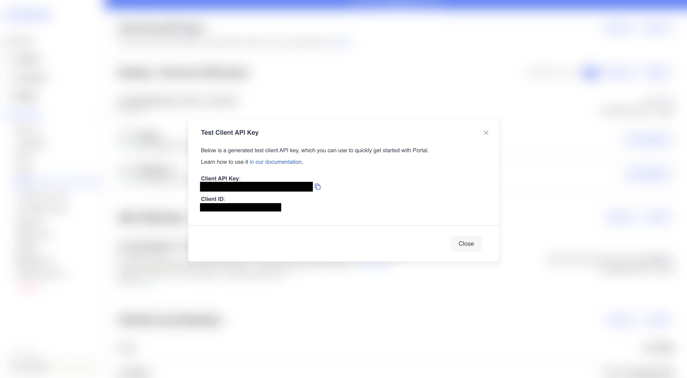
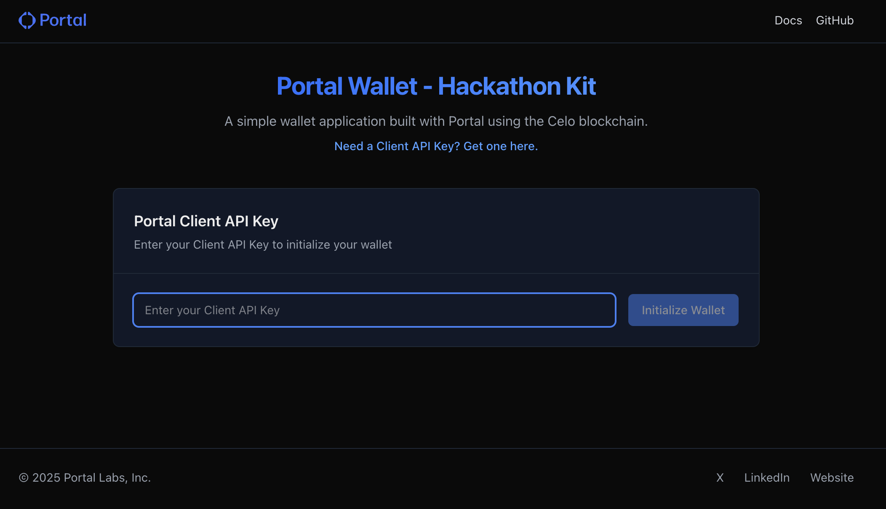
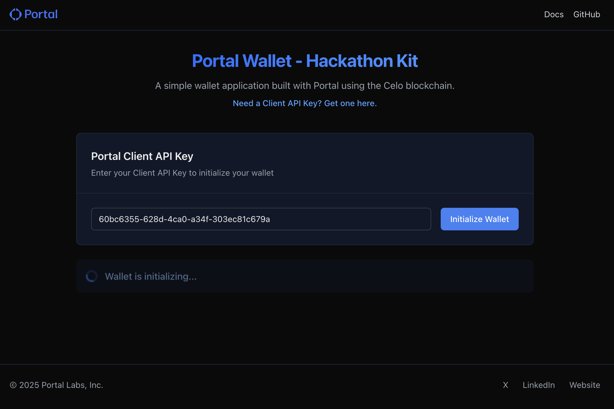
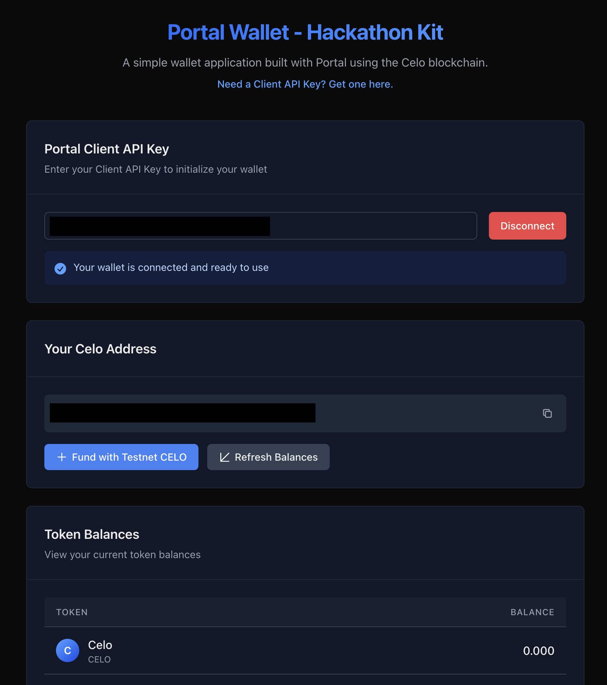
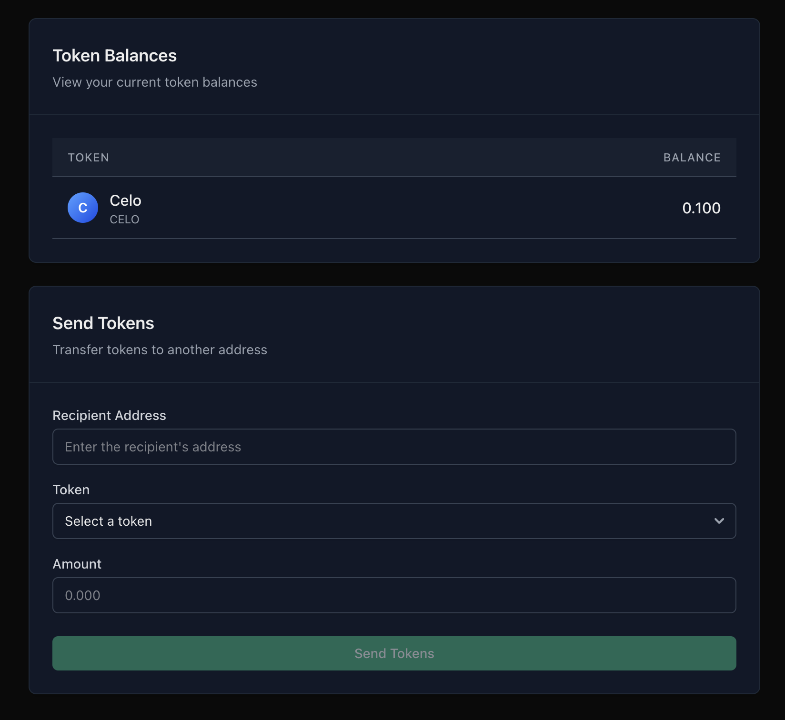

# Portal Hackathon Kit - Web SDK

This repository shows you how you can easily integrate `CELO` into your web app using the [Portal Web SDK](https://docs.portalhq.io/guides/web). It covers the following features.

1. Generate a Wallet
2. Fetch and display balances.
3. Fund wallet with `CELO` on Celo Alfajores Testnet.
4. Transfer tokens to a given recipient address.

## How to Run This Example App

1. Clone the repo
2. Go to your Portal Dashboard [Settings page](https://app.portalhq.io/settings#client-api-keys) and create a Test Client API Key.
3. Run this example app with `yarn && yarn dev` (runs on [localhost:3000](http://localhost:3000))
4. Input the Client API Key in the input field
5. Click `Initialize Wallet`

## Demo

### Create Portal Client API Key

### Input Portal Client API Key

### Create Wallet

### View Wallet Details

### Send Tokens

## Understanding the Example App

This app demonstrates how to integrate the Portal SDK in a Next.js application to create a simple web3 wallet experience. Here's how it works:

### Project Structure

- `src/pages/index.tsx` - Main application page and component structure
- `src/hooks/usePortalWallet.ts` - Custom hook that manages all Portal SDK interactions
- `src/components/` - UI components for the wallet interface
- `src/config/index.ts` - Application configuration including Celo network settings
- `src/types/index.d.ts` - TypeScript definitions for Portal SDK responses

### Key Components

- **ApiKeyInput** - Allows users to enter their Portal Client API Key and initialize the wallet
- **WalletAddress** - Displays the user's Celo address with copy functionality and funding options
- **TokenBalances** - Shows all tokens in the user's wallet with balances
- **SendTokensForm** - Form for sending tokens to another address

### Wallet Initialization Flow

1. User enters their Portal Client API Key
2. The app initializes the Portal SDK with the key and connects to the Celo Alfajores Testnet
3. The SDK creates a new wallet or retrieves an existing one
4. The app displays the wallet address and token balances

### Asset Management

The app fetches and displays the user's token balances using the Portal SDK's `getAssets` method. Users can:

- View their `CELO` and other token balances
- Fund their wallet with testnet `CELO`
- Refresh balances to see updated amounts

### Token Transfer Flow

1. User selects a token to send
2. User enters a recipient address and amount
3. The app uses Portal SDK's `sendAsset` method to create and send the transaction
4. A confirmation displays with a link to view the transaction on the Celo explorer

## Faucets for Testing

You can get more `CELO` tokens for testing with the below faucet.

- [Alfajores Testnet Faucet](https://faucet.celo.org/alfajores) - Get testnet CELO tokens

If you need tokens other than `CELO`, we recommend getting testnet `CELO` and swapping them via Mento's DEX:

- [Mento App](https://app.mento.org/) - Swap between `CELO`, `cUSD`, `USDC`, `USDT`, and more

## How to Customize

To adapt this example for your own application:

1. Replace the Client API Key with your own from the Portal Dashboard
2. Modify the UI components to match your application's design
3. Add additional features like NFT display or transaction history using Portal APIs
4. Configure for mainnet by updating the chainId in `src/config/index.ts`

## Portal Documentation

### Portal SDK Reference

Portal's SDKs have several pieces of core functionality.

- [Generating a Wallet](https://docs.portalhq.io/guides/web/create-a-wallet): This function creates MPC key shares on your local device's browser and the Portal servers. These key shares support all EVM chains, Solana, Tron, Stellar, and Bitcoin.
- [Send Tokens](https://docs.portalhq.io/guides/web/send-tokens): This function allows you to easily send tokens from your Portal wallet to another address, supporting EVM, Solana, Tron, Stellar, and Bitcoin chains.
- [Signing a Transaction](https://docs.portalhq.io/guides/web/sign-a-transaction): This function signs a provided transaction, and can broadcast that transaction to a chain when an RPC gateway URL is provided.

### Portal APIs

Portal supplies several APIs for simplifying your development.

- [Get Assets](https://docs.portalhq.io/reference/client-api/v3-endpoints#get-assets-by-chain): This endpoint returns a list of fungible asset (native, ERC-20, and SPL tokens) associated with your client for a given chain.
- [Get NFTs](https://docs.portalhq.io/reference/client-api/v3-endpoints#get-nft-assets-by-chain): This endpoint returns a list of the NFTs associated with your client for a given chain.
- [Get Transactions](https://docs.portalhq.io/reference/client-api/v3-endpoints#get-the-clients-eip-155-transaction-history): This endpoint returns a list of the historic transactions associated with your client for a given chain.
- [Build a Transaction](https://docs.portalhq.io/reference/client-api/v3-endpoints#build-a-transaction): This endpoint builds a formatted transaction to send a fungible asset (native, ERC-20, and SPL tokens) for a given chain.
- And [more](https://docs.portalhq.io/reference/client-api/v3-endpoints).

### CELO Documentation

- [Celo Docs](https://docs.celo.org/) - Official Celo documentation
- [Mento Protocol](https://www.mento.org/) - Celo's stablecoin protocol

### Other Helpful Resources

- [What is Portal MPC?](https://docs.portalhq.io/resources/portals-mpc-architecture)

## Contributing

We welcome contributions to improve this example app! To contribute:

1. Fork the repository
2. Create a new branch for your feature
3. Add your changes
4. Submit a pull request

## Help

Need help or want to request a feature? Reach out to us on the [official Portal Community Slack](https://portalcommunity.slack.com/archives/C07EZFF9N78).
